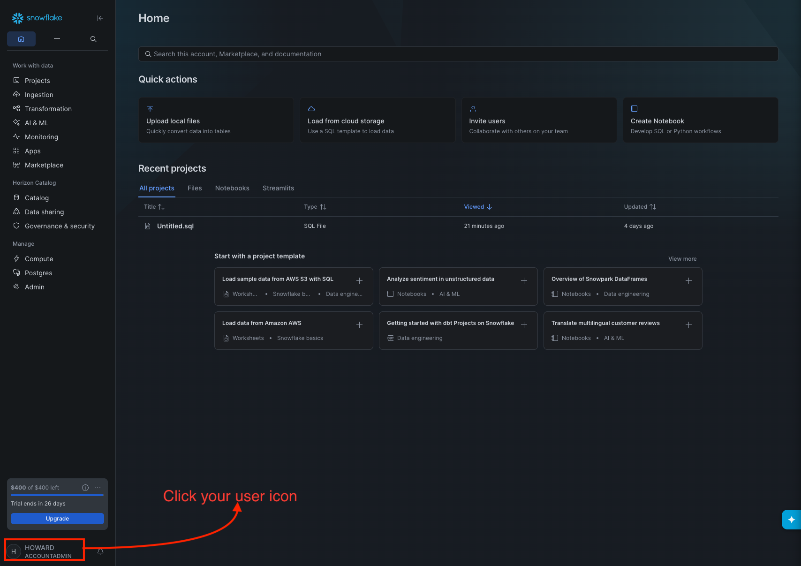
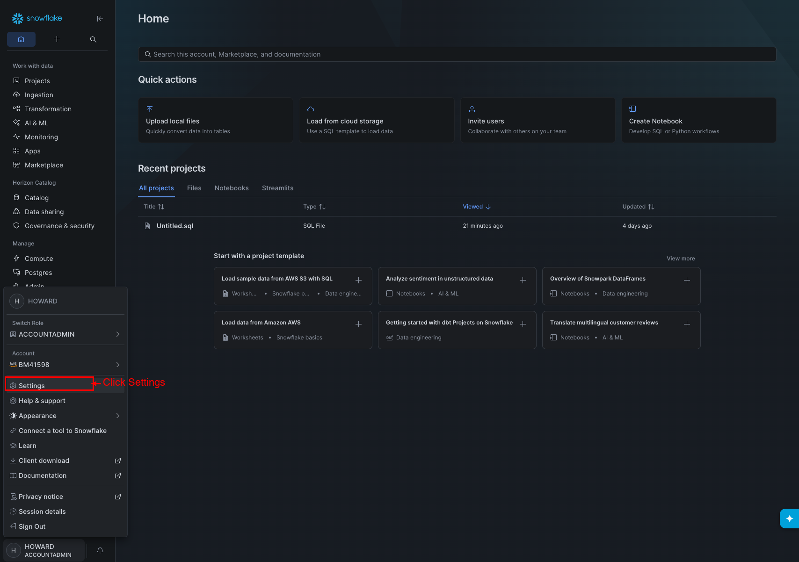
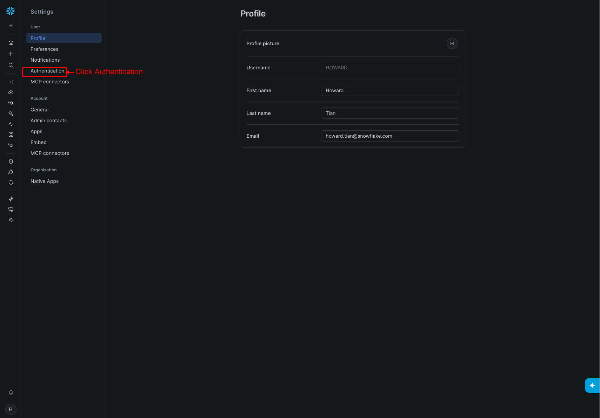
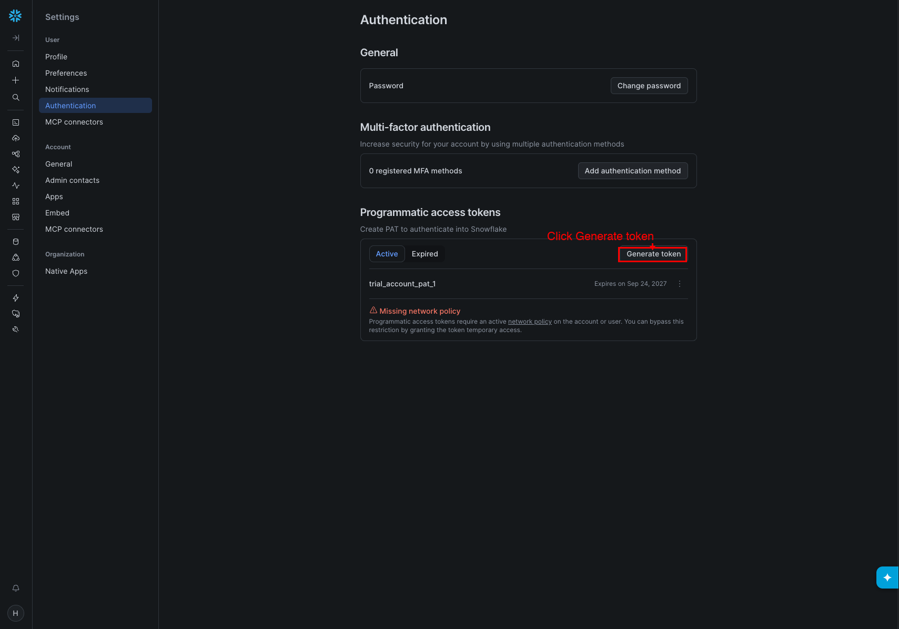
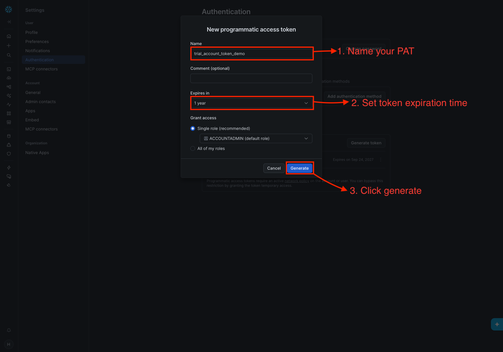
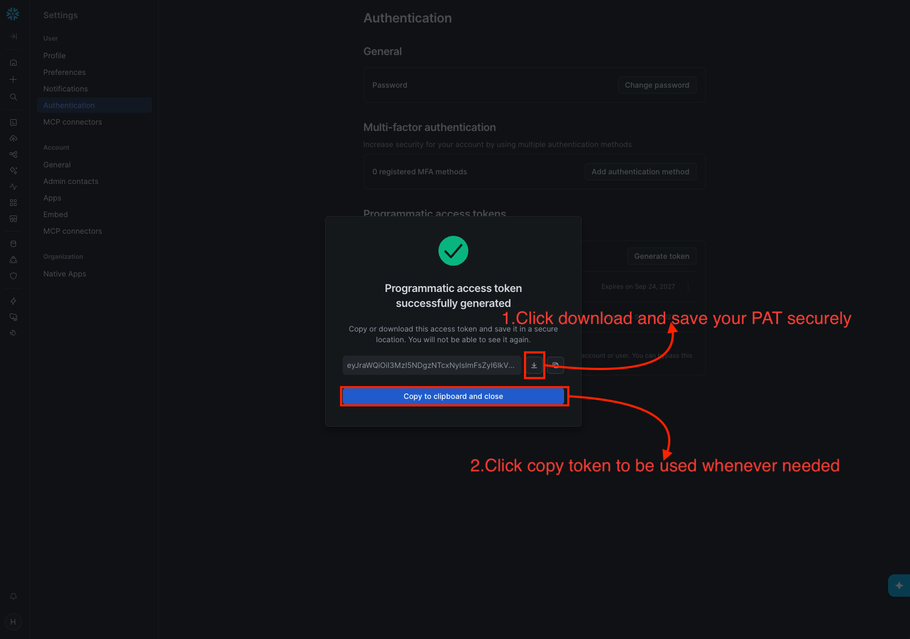

# Authentication

Cortex Training authenticates through a Snowflake Programmatic Access Token
(PAT). This page walks you through three steps:

1. **Create a PAT** — required regardless of which configuration method you use
2. **Create the database** — one-time setup for the connection config
3. **Configure the client** — pick one of the methods below to supply your PAT

## Step 1: Create a PAT

> **Heads-up:** By default, Snowflake only accepts a PAT from a user covered by
> a network policy. If Snowsight shows **Missing network policy** on your new
> token, see [Network policy requirement](#network-policy-requirement) before
> you configure the client.

1. Log in to your Snowflake account at `https://<your-account>.snowflakecomputing.com`

2. Click your **user icon** (bottom left)

   

3. Click **Settings**

   

4. Select **Authentication**

   

5. Click **Generate token**

   

6. Give it a name (e.g., `cortex-training`), set an expiry, and click **Generate**

   

7. Copy the token value immediately — you cannot view it again

   

## Step 2: Create the Database

The connection config references a database and schema. This database must
exist in your Snowflake account — otherwise the client will fail with a
"database not found" error. It is only used for connection routing, not for
storing training data.

Run this in Snowsight before configuring the client:

```sql
CREATE DATABASE IF NOT EXISTS CORTEX_TRAINING_DB;
```

You can use any database name, but it must match the `database` field in your
connection config below.

## Step 3: Configure the Client

Once you have a PAT, pick **one** of the following methods to configure the
client. We recommend `connections.toml`.

### Option A: connections.toml (recommended)

This is Snowflake's standard configuration file, shared across all Snowflake
tools. Create or edit `~/.snowflake/connections.toml`:

```toml
[training]
account = "ORG-ACCOUNT"
host = "ACCOUNT.snowflakecomputing.com"
user = "YOUR_USERNAME"
authenticator = "programmatic_access_token"
token = "YOUR_PAT"
database = "CORTEX_TRAINING_DB"
schema = "PUBLIC"
```

Protect the file:

```bash
chmod 600 ~/.snowflake/connections.toml
```

#### Finding your account and host

- **account**: your org and account name joined by a hyphen, e.g.,
  `MYORG-MYACCOUNT`. You can find this in your Snowsight URL:
  `https://app.snowflake.com/MYORG/MYACCOUNT` → `MYORG-MYACCOUNT`.
- **host**: `ACCOUNT.snowflakecomputing.com`, e.g.,
  `myorg-myaccount.snowflakecomputing.com`. Use hyphens, not underscores —
  some Snowflake admin tools show underscores but the SSL certificate requires
  hyphens.

#### Setting the default connection

To avoid passing `--connection training` on every command, set a default using
any of these methods:

- Name the profile `[default]` instead of `[training]`
- Set the environment variable:
  ```bash
  export SNOWFLAKE_DEFAULT_CONNECTION_NAME=training
  ```
- Add `default_connection_name = "training"` to `~/.snowflake/config.toml`

#### Verify

```bash
cortex-training capacity
```

This should print your available GPU capacity.

### Option B: JSON config (legacy)

Create a JSON file outside the repository:

```json
{
  "host": "ACCOUNT.snowflakecomputing.com",
  "pat": "YOUR_PAT",
  "database": "CORTEX_TRAINING_DB",
  "schema": "PUBLIC"
}
```

Register it once so subsequent commands use it automatically:

```bash
cortex-training login ~/cortex-training-config.json
cortex-training capacity
```

### Option C: Environment variables

Set credentials directly in your shell:

```bash
export CORTEX_TRAINING_HOST="ACCOUNT.snowflakecomputing.com"
export CORTEX_TRAINING_PAT="YOUR_PAT"
export CORTEX_TRAINING_DATABASE="CORTEX_TRAINING_DB"
export CORTEX_TRAINING_SCHEMA="PUBLIC"
```

Then run commands directly:

```bash
cortex-training capacity
```

Environment variables override both `connections.toml` and JSON config values.
This is useful for CI/CD pipelines or when you don't want secrets in files.

Snowflake-prefixed variants (`SNOWFLAKE_PAT`, `SNOWFLAKE_HOST`,
`SNOWFLAKE_DATABASE`, `SNOWFLAKE_SCHEMA`) are also accepted.

## Troubleshooting

| Error | Cause | Fix |
|-------|-------|-----|
| `SSL certificate verify failed` | Underscores in hostname | Replace underscores with hyphens in `host` |
| `no PAT found` | Missing token in config | Add `token` to connections.toml, `pat` to JSON, or set `CORTEX_TRAINING_PAT` |
| `401 Unauthorized` | PAT expired, invalid, or your user has no network policy | See [Network policy requirement](#network-policy-requirement), or regenerate the PAT |
| `394400 (08001)` / `Programmatic access token is invalid` | Your user has no network policy, or the PAT is wrong | See [Network policy requirement](#network-policy-requirement) |

### Network policy requirement

By default, Snowflake only accepts a PAT from a user covered by a
[network policy](https://docs.snowflake.com/en/user-guide/network-policies),
a list of IP addresses allowed to sign in. You can create a PAT without one,
but Snowflake then rejects it with `Programmatic access token is invalid` (or
`401 Unauthorized`). In Snowsight, the token shows **Missing network policy**
under **Settings → Authentication**.

#### 1. Confirm the cause (one minute)

1. In Snowsight, open **Settings → Authentication**.
2. On your token, open the **⋯** menu and choose **Bypass requirement for
   network policy**.
3. Run `cortex-training capacity` again.

If it now works, the network policy is the cause. The bypass is temporary, so
continue with step 2.

#### 2. Fix it permanently

An account administrator (`ACCOUNTADMIN` or `SECURITYADMIN`) creates a network
policy for the IP addresses you connect from, and applies it to your user:

```sql
USE ROLE ACCOUNTADMIN;

CREATE NETWORK POLICY CORTEX_TRAINING_ACCESS
  ALLOWED_IP_LIST = ('<cli-machine-ip>', '<snowsight-ip>');

ALTER USER <your-username> SET NETWORK_POLICY = CORTEX_TRAINING_ACCESS;
```

- `<cli-machine-ip>` is the public IP of the machine that runs
  `cortex-training`. Get it on that machine with `curl -s https://ifconfig.me`.
- `<snowsight-ip>` is the IP you open Snowsight from. Include it so the policy
  doesn't lock you out of Snowsight.

If your organization manages this centrally, your administrator may prefer an
authentication policy instead; see Snowflake's
[programmatic access token documentation](https://docs.snowflake.com/en/user-guide/programmatic-access-tokens#network-policy-requirements).

#### Still failing?

If Snowsight shows no network policy warning, or the bypass didn't help:

- Generate a new PAT and paste it without extra spaces or quotes.
- Check that `user` in your connection config is the user who owns the token.
